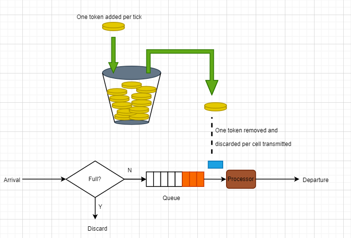
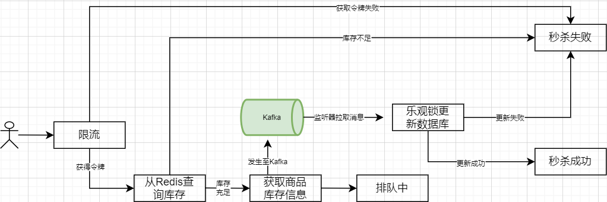

### 秒杀系统介绍

 秒杀无论是双十一购物还是 12306 抢票，秒杀场景已随处可见。简单来说，秒杀就是在同一时刻大量请求争抢购买同一商品并完成交易的过程。从架构视角来看，秒杀系统本质是一个高性能、高一致、高可用的系统。

master test
master test
master test
master test

#### 1 秒杀系统特点

秒杀活动对稀缺或者特价的商品进行定时定量售卖，吸引成大量的消费者进行抢购，但又只有少部分消费者可以下单成功。因此，秒杀活动将在较短时间内产生比平时大数十倍，上百倍的页面访问流量和下单请求流量。

1. 高并发：秒杀的特点就是这样时间极短、 瞬间用户量大。
2. 库存量少：一般秒杀活动商品量很少，这就导致了只有极少量用户能成功购买到。
3. 业务简单：流程比较简单，一般都是下订单、扣库存、支付订单
4. 恶意请求，数据库压力大
5. 秒杀的商品不需要添加到购物车
6. 秒杀系统独立部署


##### 1.1 秒杀活动可以分为3个阶段：

1. 秒杀前：用户不断刷新商品详情页，页面请求达到瞬时峰值。
2. 秒杀开始：用户点击秒杀按钮，下单请求达到瞬时峰值。
3. 秒杀后：一部分成功下单的用户不断刷新订单或者产生退单操作，大部分用户继续刷新商品详情页等待退单机会。

##### 1.2 保护高并发系统的3把利器

1. 缓存：缓存的目的是提升系统访问速度和增大系统处理容量
2. 降级：降级是当服务器压力剧增的情况下，根据当前业务情况及流量对一些服务和页面有策略的降级，以此释放服务器资源以保证核心任务的正常运行
3. 限流：限流的目的是通过对并发访问/请求进行限速，或者对一个时间窗口内的请求进行限速来保护系统，一旦达到限制速率则可以拒绝服务、排队或等待、降级等处理。

#### 2 秒杀需要解决的问题

1. 商品超卖问题
2. 高平发的处理
3. 库存和订单一致性的问题

#### 3 秒杀系统设计理念

1. 限流：鉴于只有少部分用户能够秒杀成功，所以要限制大部分流量，只允许少部分流量进入服务后端（暂未处理）。
2. 削峰：对于秒杀系统瞬时的大量用户涌入，所以在抢购开始会有很高的瞬时峰值。实现削峰的常用方法有利用缓存或消息中间件等技术。
3. 异步处理：对于高并发系统，采用异步处理模式可以极大地提高系统并发量，异步处理就是削峰的一种实现方式。
4. 内存缓存：秒杀系统最大的瓶颈最终都可能会是数据库的读写，主要体现在的磁盘的 I/O，性能会很低，如果能把大部分的业务逻辑都搬到缓存来处理，效率会有极大的提升。
5. 可拓展：如果需要支持更多的用户或更大的并发，将系统设计为弹性可拓展的，如果流量来了，拓展机器就好。

#### 4 优化思路

- 后端优化：将请求尽量拦截在系统上游
  - 限流：屏蔽掉无用的流量，允许少部分流量走后端。假设现在库存为 `10`，有 `1000 `个购买请求，最终只有 `10 `个可以成功，`99%` 的请求都是无效请求
  - 削峰：秒杀请求在时间上高度集中于某一个时间点，瞬时流量容易压垮系统，因此需要对流量进行削峰处理，缓冲瞬时流量，尽量让服务器对资源进行平缓处理
  - 异步：将同步请求转换为异步请求，来提高并发量，本质也是削峰处理
  - 利用缓存：创建订单时，每次都需要先查询判断库存，只有少部分成功的请求才会创建订单，因此可以将商品信息放在缓存中，减少数据库查询
  - 负载均衡：利用 Nginx 等使用多个服务器并发处理请求，减少单个服务器压力
- 前端优化：
  - 限流：前端答题或验证码，来分散用户的请求
  - 禁止重复提交：限定每个用户发起一次秒杀后，需等待才可以发起另一次请求，从而减少用户的重复请求
  - 本地标记：用户成功秒杀到商品后，将提交按钮置灰，禁止用户再次提交请求
  - 动静分离：将前端静态数据直接缓存到离用户最近的地方，比如用户浏览器、CDN 或者服务端的缓存中
- 防作弊优化：
  - 隐藏秒杀接口：如果秒杀地址直接暴露，在秒杀开始前可能会被恶意用户来刷接口，因此需要在没到秒杀开始时间不能获取秒杀接口，只有秒杀开始了，才返回秒杀地址 url 和验证 MD5，用户拿到这两个数据才可以进行秒杀
  - 同一个账号多次发出请求：在前端优化的禁止重复提交可以进行优化；也可以使用 Redis 标志位，每个用户的所有请求都尝试在 Redis 中插入一个 `userId_secondsKill` 标志位，成功插入的才可以执行后续的秒杀逻辑，其他被过滤掉，执行完秒杀逻辑后，删除标志位
  - 多个账号一次性发出多个请求：一般这种请求都来自同一个 IP 地址，可以检测 IP 的请求频率，如果过于频繁则弹出一个验证码
  - 多个账号不同 IP 发起不同请求：这种一般都是僵尸账号，检测账号的活跃度或者等级等信息，来进行限制。比如微博抽奖，用 iphone 的年轻女性用户中奖几率更大。通过用户画像限制僵尸号无法参与秒杀或秒杀不能成功


### 系统实现

数据库建表

```sql
-- ----------------------------
-- Table structure for sk_order
-- ----------------------------
DROP TABLE IF EXISTS `sk_order`;
CREATE TABLE `sk_order` (
  `id` int(11) unsigned NOT NULL AUTO_INCREMENT,
  `sid` int(11) NOT NULL COMMENT '库存ID',
  `create_time` timestamp NOT NULL DEFAULT CURRENT_TIMESTAMP ON UPDATE CURRENT_TIMESTAMP COMMENT '创建时间',
  PRIMARY KEY (`id`)
) ENGINE=InnoDB DEFAULT CHARSET=utf8;

-- ----------------------------
-- Table structure for sk_stock
-- ----------------------------
DROP TABLE IF EXISTS `sk_stock`;
CREATE TABLE `sk_stock` (
  `id` int(11) unsigned NOT NULL AUTO_INCREMENT,
  `count` int(11) NOT NULL COMMENT '库存',
  `sale` int(11) NOT NULL COMMENT '已售',
  `version` int(11) NOT NULL COMMENT '版本号',
  PRIMARY KEY (`id`)
) ENGINE=InnoDB DEFAULT CHARSET=utf8;
```

#### 1 基本思路


```java
public int createNormalOrder(int sid) {
    //检查库存
    Stock stock = stockService.checkStock(sid);
    //出售
    stockService.saleStock(stock);
    //创建订单
    return createOrder(stock);
}
//检查库存
public Stock checkStock(int sid) {

    Stock stock = stockMapper.selectStockById(sid);

    if (stock.getCount() < 1) {
        throw new RuntimeException("库存不足");
    }
    return stock;
}
//出售
public int saleStock(Stock stock) {

    stock.setCount(stock.getCount() - 1);
    stock.setSale(stock.getSale() + 1);
    
    return stockMapper.updateStockById(stock);
}
//创建订单
private int createOrder(Stock stock) {

    Order order = new Order();
    order.setSid(stock.getId());
    order.setCreateTime(new Date());
    int result = orderMapper.insertOrder(order);
    if (result == 0) {
        throw new RuntimeException("创建订单失败");
    }
    return result;
}
```

**可能会出现超卖问题**

#### 2 乐观锁解决超卖问题


```java
//乐观锁
public int createOptimisticLock(int sid) {

    Stock stock = stockService.checkStock(sid);
    int count = stockService.updateStockByOptimisticLock(stock);
    if (count == 0) {
        throw new RuntimeException("并发更新库存失败");
    }
    return createOrder(stock);
}
```

```sql
@Update("UPDATE sk_stock SET count = count - 1, sale = sale + 1, version = version + 1 " +
        "WHERE id = #{id, jdbcType = INTEGER} " +
        "AND version = #{version, jdbcType = INTEGER}")
int updateByOptimistic(Stock stock);
```

#### 3 接口限流

#####  1 什么是接口限流？

 某一时间窗口内的请求数进行限制，保持系统的可用性和稳定性，防止因流量暴增而导致的系统运行缓慢或宕机。根据前面的优化分析，假设现在有`10`个商品，有`1000`个并发秒杀请求，最终只有`10`个订单会成功创建，也就是说有`990`的请求是无效的，这些无效的请求也会给数据库带来压力，因此可以在在请求落到数据库之前就将无效的请求过滤掉，将并发控制在一个可控的范围，这样落到数据库的压力就小很多。

常用限流算法有**令牌桶**、**漏斗**算法。


##### 2 漏斗算法

把请求比作是水，水来了都先放进桶里，并以限定的速度出水，当水来得过猛而出水不够快时就会导致水直接溢出，即拒绝服务。漏斗有一个进水口和一个出水口，出水口以一定速率出水，并且有一个最大出水速率。


1. 在漏斗中没有水的时候:
   - 如果进水速率小于等于最大出水速率，那么，出水速率等于进水速率，此时，不会积水
   - 如果进水速率大于最大出水速率，那么，漏斗以最大速率出水，此时，多余的水会积在漏斗中
2. 在漏斗中有水的时候:
   - 如果漏斗未满，且有进水的话，那么这些水会积在漏斗中
   - 如果漏斗已满，且有进水的话，那么这些水会溢出到漏斗之外，**对于溢出的流量，漏斗会采用拒绝的方式，防止流量继续进入。**

**对于很多应用场景来说，除了要求能够限制数据的平均传输速率外，还要求允许某种程度的突发传输。**这时候漏桶算法可能就不合适。

**代码实现：**

```java
class FunnelRateLimiter {
    // 容量
    private final int capacity;
    // 每毫秒漏水的速度
    private final double leakingRate;
    // 漏斗没有被占满的体积
    private int emptyCapacity;
    // 上次漏水的时间
    private long lastLeakingTime = System.currentTimeMillis();
    
    FunnelRateLimiter(int capacity, double leakingRate) {
        this.capacity = capacity;
        this.leakingRate = leakingRate;
        // 初始化为一个空的漏斗
        this.emptyCapacity = capacity;
    }

    private void makeSpace() {
        long currentTimeMillis = System.currentTimeMillis();
       // 计算离上次漏斗的时间
        long gap = currentTimeMillis - lastLeakingTime;
       // 计算离上次漏斗的时间到现在漏掉的水
        double deltaQuota = (int) gap * leakingRate;
        // 更新上次漏的水
        lastLeakingTime = currentTimeMillis;
        // 间隔时间太长，整数数字过大溢出 
       if (deltaQuota < 0) {
            emptyCapacity = capacity;
        }
        // 更新腾出的空间
        emptyCapacity += deltaQuota;
        // 超出最大限制 复原
        if (emptyCapacity > capacity) {
            emptyCapacity = capacity;
        }
    }

    boolean isActionAllowed(int quota) {
        makeSpace();
       // 如果腾出的空间大于需要的空间
        if (emptyCapacity >= quota) {
           // 给腾出空间注入流量
            emptyCapacity -= quota;
            return true;
        }
        return false;
    }
}
```


##### 3 令牌桶算法

最初来源于计算机网络。在网络传输数据时，为了防止网络拥塞，需限制流出网络的流量，使流量以比较均匀的速度向外发送。令牌桶算法就实现了这个功能，可控制发送到网络上数据的数目，并允许突发数据的发送。大小固定的令牌桶可自行以恒定的速率源源不断地产生令牌。**如果令牌不被消耗，或者被消耗的速度小于产生的速度，令牌就会不断地增多，直到把桶填满。后面再产生的令牌就会从桶中溢出，最后桶中可以保存的最大令牌数永远不会超过桶的大小**。这意味，**面对瞬时大流量，该算法可以在短时间内请求拿到大量令牌**，而且拿令牌的过程并不是消耗很大的事情。



> `Google`开源工具包`Guava`提供了限流工具类`RateLimiter`，该类基于令牌桶算法来完成限流。
>
> `Guava`有两种限流模式，一种为稳定模式(`SmoothBursty`:令牌生成速度恒定)，一种为渐进模式(`SmoothWarmingUp`:令牌生成速度缓慢提升直到维持在一个稳定值) 两种模式实现思路类似，主要区别在等待时间的计算上。

通过调用`RateLimiter`的`create`接口来创建实例，实际是调用的`SmoothBuisty`稳定模式创建的实例。

```java
public static RateLimiter create(double permitsPerSecond) {
    return create(permitsPerSecond, SleepingStopwatch.createFromSystemTimer());
}

//SleepingStopwatch：时钟类实例，通过这个来计算时间及令牌
//maxBurstSeconds：在ReteLimiter未使用时，最多保存几秒的令牌，默认是1
static RateLimiter create(double permitsPerSecond, SleepingStopwatch stopwatch) {
    RateLimiter rateLimiter = new SmoothBursty(stopwatch, 1.0 /* maxBurstSeconds */);
    rateLimiter.setRate(permitsPerSecond);
    return rateLimiter;
}
```

**SmoothRateLimiter关键属性**

```java
/**
 * 在RateLimiter未使用时，最多存储几秒的令牌
 * */
 final double maxBurstSeconds;

/**
 * 当前存储令牌数
 */
double storedPermits;

/**
 * 最大存储令牌数 = maxBurstSeconds * stableIntervalMicros(见下文)
 */
double maxPermits;

/**
 * 添加令牌时间间隔 = SECONDS.toMicros(1L) / permitsPerSecond；(1秒/每秒的令牌数)
 */
double stableIntervalMicros;

/**
 * 下一次请求可以获取令牌的起始时间
 * 由于RateLimiter允许预消费，上次请求预消费令牌后
 * 下次请求需要等待相应的时间到nextFreeTicketMicros时刻才可以获取令牌
 */
private long nextFreeTicketMicros = 0L; // could be either in the past or future

```

**几个关键函数**

```java
//通过这个接口设置令牌通每秒生成令牌的数量，内部时间通过调用SmoothRateLimiter的doSetRate来实现
public final void setRate(double permitsPerSecond) {
  checkArgument(
      permitsPerSecond > 0.0 && !Double.isNaN(permitsPerSecond), "rate must be positive");
  synchronized (mutex()) {
    doSetRate(permitsPerSecond, stopwatch.readMicros());
  }
}

//先通过调用resync生成令牌以及更新下一期令牌生成时间，然后更新stableIntervalMicros，最后又调用了SmoothBursty的doSetRate
@Override
final void doSetRate(double permitsPerSecond, long nowMicros) {
  resync(nowMicros);
  double stableIntervalMicros = SECONDS.toMicros(1L) / permitsPerSecond;
  this.stableIntervalMicros = stableIntervalMicros;
  doSetRate(permitsPerSecond, stableIntervalMicros);
}

void resync(long nowMicros) {
  // 当前时间是否大于下一个令牌生成时间
  if (nowMicros > nextFreeTicketMicros) {
    // 可生成的令牌数 newPermits = （当前时间 - 下一个令牌生成时间）/ 令牌生成时间间隔。
    // 如果 QPS 为2，这里的 coolDownIntervalMicros 就是 500000.0 微秒(500ms)
    double newPermits = (nowMicros - nextFreeTicketMicros) / coolDownIntervalMicros();
    // 更新令牌库存 storedPermits。
    storedPermits = min(maxPermits, storedPermits + newPermits);
    // 更新下一个令牌生成时间 nextFreeTicketMicros
    nextFreeTicketMicros = nowMicros;
  }
}
```

根据令牌桶算法，桶中的令牌是持续生成存放的，有请求时需要先从桶中拿到令牌才能开始执行，谁来持续生成令牌存放呢？

1. 开启一个定时任务，由定时任务持续生成令牌。这样的问题在于会极大的消耗系统资源，如，某接口需要分别对每个用户做访问频率限制，假设系统中存在6W用户，则至多需要开启6W个定时任务来维持每个桶中的令牌数，这样的开销是巨大的。
2. 延迟计算，如上`resync`函数。该函数会在每次获取令牌之前调用，其实现思路为，若当前时间晚于`nextFreeTicketMicros`，则计算该段时间内可以生成多少令牌，将生成的令牌加入令牌桶中并更新数据。是在每次令牌获取时才进行计算令牌是否足够的。它通过存储的下一个令牌生成的时间，和当前获取令牌的时间差，再结合阈值，去计算令牌是否足够，同时再记录下一个令牌的生成时间以便下一次调用。

```java
@Override
void doSetRate(double permitsPerSecond, double stableIntervalMicros) {
  double oldMaxPermits = this.maxPermits;
  maxPermits = maxBurstSeconds * permitsPerSecond;
  if (oldMaxPermits == Double.POSITIVE_INFINITY) {
    // if we don't special-case this, we would get storedPermits == NaN, below
    storedPermits = maxPermits;
  } else {
    storedPermits =
        (oldMaxPermits == 0.0)
            ? 0.0 // initial state
            : storedPermits * maxPermits / oldMaxPermits;
  }
}
```

桶中可存放的最大令牌数由`maxBurstSeconds`计算而来，其含义为最大存储`maxBurstSeconds`秒生成的令牌。该参数的作用在于，可以更为灵活地控制流量。

```java
@CanIgnoreReturnValue
public double acquire() {
  return acquire(1);
}


@CanIgnoreReturnValue
public double acquire(int permits) {
  long microsToWait = reserve(permits);
  stopwatch.sleepMicrosUninterruptibly(microsToWait);
  return 1.0 * microsToWait / SECONDS.toMicros(1L);
}


final long reserve(int permits) {
  checkPermits(permits);
  synchronized (mutex()) {
    return reserveAndGetWaitLength(permits, stopwatch.readMicros());
  }
}

final long reserveAndGetWaitLength(int permits, long nowMicros) {
  long momentAvailable = reserveEarliestAvailable(permits, nowMicros);
  return max(momentAvailable - nowMicros, 0);
}
```

`acquire`函数主要用于获取`permits`个令牌，并计算需要等待多长时间，进而挂起等待，并将该值返回，主要通过`reserve`返回需要等待的时间，`reserve`中通过调用`reserveAndGetWaitLength`获取等待时间

`tryAcquire`函数可以尝试在`timeout`时间内获取令牌，如果可以则挂起等待相应时间并返回`true`，否则立即返回`false`。`canAcquire`用于判断`timeout`时间内是否可以获取令牌，通过判断当前时间+超时时间是否大于`nextFreeTicketMicros `来决定是否能够拿到足够的令牌数，如果可以获取到，则过程同`acquire`，线程`sleep`等待，如果通过`canAcquire`在此超时时间内不能回去到令牌，则可以快速返回，不需要等待`timeout`后才知道能否获取到令牌。


##### 4 代码实现


###### 4.1 Guava令牌桶限流

```java
// 创建令牌桶实例, 每秒给桶中放10个令牌
private RateLimiter rateLimiter = RateLimiter.create(10);

/**
 * Guava令牌桶限流
 *
 */
@PostMapping("createGuavaLimitOrder")
public String createGuavaLimitOrder(int sid) {
    int res = 0;

//rateLimiter.tryAcquire()
//尝试获取1个令牌，不会阻塞当前线程，立即返回是否获取成功。

    try {
        if (rateLimiter.tryAcquire()) {
            res = orderService.createOptimisticLock(sid);
        }
    } catch (Exception e) {
        log.error("Exception: " + e);
    }

    return res == 1 ? SUCCESS : ERROR;
}
```


###### 4.2 Redis实现限流

在 `RedisPool `中对 `Jedis `线程池进行了简单的封装，封装了初始化和关闭方法，同时在 `RedisPoolUtil `中对 `Jedis `常用 `API `进行简单封装，每个方法调用完毕则关闭 `Jedis `连接。限流要保证写入 `Redis `操作的原子性，因此利用 `Redis `的单线程机制，通过 `lua`脚本来完成。

```java
/**
 * Redis 限流
 */
public class RedisLimit {
    private static final int FAIL_CODE = 0;
    @Value("${spring.redis.limit}")
    private Integer limit;
    
    public Boolean limit() {
        Jedis jedis = null;
        long result = 0;
        try {
            // 获取 jedis 实例
            jedis = RedisPool.getJedis();
            // 解析 Lua 文件
            String script = ScriptUtil.getScript("limit.lua");
            // 请求限流
            String key = String.valueOf(System.currentTimeMillis() / 1000);
            // 计数限流
            result = (long) jedis.eval(script, Collections.singletonList(key),
                    Collections.singletonList(String.valueOf(limit)));
            if (FAIL_CODE != result) {
                log.info("成功获取令牌");
                return true;
            }
        } catch (Exception e) {
            log.error("limit 获取 Jedis 实例失败：", e);
        } finally {
            RedisPool.jedisPoolClose(jedis);
        }
        return false;
    }
}

/**
 * 乐观锁加redis限流
 *
 */
@PostMapping("createOptimisticLockWithLimitOrder")
public String createOptimisticLockWithLimitOrder(int sid) {
    int res = 0;
    try {
        if (redisLimit.limit()) {
            res = orderService.createOptimisticLock(sid);
        }
    } catch (Exception e) {
        log.error("Exception: " + e);
    }
    return res == 1 ? SUCCESS : ERROR;
}
```

**lua脚本**

```lua
-- 计数限流
-- 每次请求都将当前时间，精确到秒作为 key 放入 Redis 中，超时时间设置为 2s， Redis 将该 key 的值进行自增
-- 当达到阈值时返回错误，表示请求被限流
-- 写入 Redis 的操作用 Lua 脚本来完成，利用 Redis 的单线程机制可以保证每个 Redis 请求的原子性

-- 资源唯一标志位
local key = KEYS[1]
-- 限流大小
local limit = tonumber(ARGV[1])

-- 获取当前流量大小
local currentLimit = tonumber(redis.call('get', key) or "0")

if currentLimit + 1 > limit then
    -- 达到限流大小 返回
    return 0
else
    -- 没有达到阈值 value + 1
    redis.call("INCRBY", key, 1)
    -- 设置过期时间
    redis.call("EXPIRE", key, 2)
    return currentLimit + 1
end
```


#### 4 Redis缓存库存信息


虽然限流能够过滤掉一些无效的请求，但是还是会有很多请求落在数据库上，通过 `Druid` 监控可以看出，实时查询库存的语句被大量调用，对于每个没有被过滤掉的请求，都会去数据库查询库存来判断库存是否充足，对于这个查询可以放在缓存 `Redis `中，`Redis `的数据是存放在内存中的，速度快很多。

##### 4.1 数据预热

在秒杀开始前，需要将秒杀商品信息提前缓存到 `Redis `中，这么秒杀开始时则直接从 `Redis `中读取，也就是缓存预热，`Springboot `中开发者通过 `implement ApplicationRunner` 来设定 `SpringBoot `启动后立即执行的方法

```java
public void run(ApplicationArguments args) throws Exception {
    // 从数据库中查询热卖商品存入redis
    Stock stock = stockService.getStockById(1);

    // 删除旧缓存
    RedisPoolUtil.del(RedisKeysConstant.STOCK_COUNT + stock.getCount());
    RedisPoolUtil.del(RedisKeysConstant.STOCK_SALE + stock.getSale());
    RedisPoolUtil.del(RedisKeysConstant.STOCK_VERSION + stock.getVersion());

    //缓存预热
    int sid = stock.getId();
    RedisPoolUtil.set(RedisKeysConstant.STOCK_COUNT + sid, String.valueOf(stock.getCount()));
    RedisPoolUtil.set(RedisKeysConstant.STOCK_SALE + sid, String.valueOf(stock.getSale()));
    RedisPoolUtil.set(RedisKeysConstant.STOCK_VERSION + sid,
            String.valueOf(stock.getVersion()));
}
```

##### 4.2 缓存和数据一致性

#### 5 Kafka异步

服务器的资源是恒定的，你用或者不用它的处理能力都是一样的，所以出现峰值的话，很容易导致忙到处理不过来，闲的时候却又没有什么要处理，因此可以通过削峰来延缓用户请求的发出，让服务端处理变得更加平稳。

可以使用消息队列 Kafka 来缓冲瞬时流量，将同步的直接调用转成异步的间接推送，中间通过一个队列在一端承接瞬时的流量洪峰，在另一端平滑地将消息推送出去。



```java
/**
 * 将消息发送到kafka
 * @param sid
 */
@Override
public void createOrderWithLimitAndRedisAndKafka(int sid) {

    // redis校验库存
    Stock stock = stockService.checkStockWithRedis(sid);

    // 下单请求发送至 kafka，需要序列化 stock
    kafkaTemplate.send(kafkaTopic, gson.toJson(stock));
    log.info("消息发送至 Kafka 成功");
}

/**
 * 监听消息
 * @param sid
 */
public class ConsumerListen {
    private Gson gson = new GsonBuilder().create();
    @Autowired
    private OrderService orderService;

    @KafkaListener(topics = "seckill_topic")
    public void listen(ConsumerRecord<String, String> record) {
        try {
            Optional<?> kafkaMessage = Optional.ofNullable(record.value());
            // Object -> String
            String message = (String) kafkaMessage.get();
            // 反序列化
            Stock stock = gson.fromJson((String) message, Stock.class);
            // 创建订单
            orderService.consumerTopicToCreateOrderWithKafka(stock);

        } catch (Exception e) {
            log.error("Exception:" + e);
        }
    }
}

/**
 * 消费kafka消息
 * @param stock
 */
@Override
public void consumerTopicToCreateOrderWithKafka(Stock stock) {

    // 乐观锁更新库存和 Redis
    stockService.updateStockOptimisticLockWithRedis(stock);

    int res = createOrder(stock);
    if (res == 1) {
        log.info("Kafka 消费 Topic 创建订单成功");
    } else {
        log.info("Kafka 消费 Topic 创建订单失败");
    }
}
```


### Jmeter并发测试

结果可以看到，guava限流redis实现效果更好。

基本秒杀思路


乐观锁


redis限流


guava限流


redis限流+redis缓存


guava限流+redis缓存


redis限流+kafka异步


guava 限流+kafka异步


